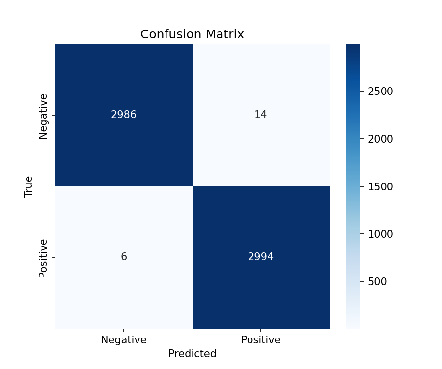

# Bridge Deck Crack Detection

Binary image classification of concrete bridge deck surfaces as **cracked** or **not cracked**, using MobileNetV2 transfer learning and deployed as a public Streamlit web application.

GET 324, Laboratory Exercise 10 (Mini-Project). Group EE3, 2022 admission set. Department of Electrical and Electronic Engineering.


### ➜ Live application: **[TBD: paste the streamlit.app link here]**

---

## Contents

- [The problem](#the-problem)
- [What the application does](#what-the-application-does)
- [Dataset](#dataset)
- [Model](#model)
- [Results](#results)
- [Why accuracy is not the headline number](#why-accuracy-is-not-the-headline-number)
- [Repository structure](#repository-structure)
- [Run it locally](#run-it-locally)
- [Reproduce the training](#reproduce-the-training)
- [Deployment](#deployment)
- [Limitations](#limitations)
- [Contributors](#contributors)
- [Citations](#citations)
- [License](#license)

---

## The problem

Concrete bridge decks crack. Left undetected, a hairline crack admits water and chloride, which corrodes the reinforcing steel, which spalls the concrete, which becomes a structural problem and eventually a very expensive one.

Detection is still largely manual. An engineer walks the deck with a clipboard and marks what they see. That process is slow, it is subjective, it varies between inspectors, and fine cracks are routinely missed until they have already propagated.

A model that classifies deck surface photographs can front-run that process. Images captured by a drone or a phone get screened automatically, and the inspector's time goes to the regions the model flagged instead of to the whole deck. A multi-day survey becomes a same-day screening pass followed by a targeted inspection.

This project builds and deploys that classifier.

## What the application does

Upload a photograph of a concrete surface. The application returns:

- A label, `Cracked` or `Not cracked`
- A confidence score for that prediction
- The decision threshold that was applied, so the score is interpretable

The trained model runs server-side. No image is stored.

<!-- After deployment, replace this comment with a screenshot:
      -->

**[TBD: add `assets/app_screenshot.png` once the app is live]**

---

## Dataset

### Primary: SDNET2018 (bridge deck subset)

[SDNET2018](https://digitalcommons.usu.edu/all_datasets/48/) is an annotated concrete crack image dataset published by Utah State University. It contains over 56,000 sub-images at 256×256 px, segmented from 230 original photographs taken with a 16 MP Nikon camera at a 500 mm working distance. Crack widths span 0.06 mm to 25 mm.

Critically, the images deliberately include real-world obstructions: shadows, surface roughness, scaling, edges, joints, holes, stains and background debris. These are exactly the features that produce false positives on real inspection photographs, and their presence is why this dataset is harder, and more honest, than a clean laboratory set.

We use the **bridge deck subset only** (`D`), because the assigned task is bridge decks and this is the only major public dataset collected from actual bridge deck sections.

| Surface | Cracked | Non-cracked | Total | % cracked |
|---|---:|---:|---:|---:|
| **Bridge deck (D)** | **2,025** | **11,595** | **13,620** | **14.9%** |
| Wall (W) | 3,851 | 14,287 | 18,138 | 21.2% |
| Pavement (P) | 2,608 | 21,726 | 24,334 | 10.7% |
| Total | 8,484 | 47,608 | 56,092 | 15.1% |

**Directory layout.** Three top-level folders: `D` (decks), `W` (walls), `P` (pavements). Each contains a `C`-prefixed cracked folder and a `U`-prefixed uncracked folder. We read `D/CD` and `D/UD`.

**Where to get it**

| Source | Link | Notes |
|---|---|---|
| Kaggle mirror | [`aniruddhsharma/structural-defects-network-concrete-crack-images`](https://www.kaggle.com/datasets/aniruddhsharma/structural-defects-network-concrete-crack-images) | Easiest route, pulls into Colab with the Kaggle API |
| Utah State University (official) | [digitalcommons.usu.edu/all_datasets/48](https://digitalcommons.usu.edu/all_datasets/48/) · DOI [10.15142/T3TD19](https://doi.org/10.15142/T3TD19) | Canonical release |
| IEEE DataPort | [ieee-dataport.org](https://ieee-dataport.org/documents/sdnet2018-concrete-crack-image-dataset-machine-learning-applications) · DOI [10.21227/jpvp-3z39](https://doi.org/10.21227/jpvp-3z39) | Mirror |

### Supplementary: Concrete Crack Images for Classification

[Özgenel and Gönenç Sorguç, Mendeley Data](https://data.mendeley.com/datasets/5y9wdsg2zt/2) · DOI [10.17632/5y9wdsg2zt.2](https://doi.org/10.17632/5y9wdsg2zt.2). Kaggle mirror: [`arunrk7/surface-crack-detection`](https://www.kaggle.com/datasets/arunrk7/surface-crack-detection).

40,000 images at 227×227 px, perfectly balanced at 20,000 cracked and 20,000 non-cracked, generated from 458 high-resolution photographs of concrete building surfaces.

> **How this set is used.** Training split only, to give the model more positive examples. It never appears in validation or test. Every metric reported below comes from a **deck-only held-out test set**. Evaluating on this cleaner building-surface data would inflate the numbers past the point of meaning anything.

### Splits

Stratified, computed before any augmentation, with a fixed random seed recorded in the notebook.

| Split | Proportion |
|---|---|
| Train | 70% |
| Validation | 15% |
| Test | 15% |

The dataset images are **not** committed to this repository. Download them using the links above; `src/data_prep.py` builds the split.

---

## Model

MobileNetV2 transfer learning, chosen because it trains in minutes on a free Colab GPU, produces a model small enough to serve inside a 1 GB memory limit, and outperforms a from-scratch CNN on a dataset of this size.

| Item | Value |
|---|---|
| Base | MobileNetV2, ImageNet weights |
| Input | 224 × 224 × 3 |
| Head | Global average pooling → dropout → dense(1), sigmoid |
| Stage 1 | Frozen base, head trained |
| Stage 2 | Last convolutional block unfrozen, fine-tuned at a reduced learning rate |
| Loss | Binary cross-entropy |
| Class imbalance | Class weighting during training |
| Augmentation | Random flip, rotation, brightness and contrast jitter |
| Optimizer | Adam |

**On input resolution.** The source images are 256×256 and many cracks are hairline. 224×224 is the smallest safe input. Do not downscale further to save memory; below roughly 200 px the crack signal starts disappearing into the resampling and recall collapses.

---

## Results

> **These are placeholders. Populate them from the deck-only held-out test set before submission.** Do not paste training or validation numbers here, and do not paste numbers obtained on the supplementary dataset.

| Metric | Value |
|---|---|
| Test set size | TBD |
| Accuracy | TBD |
| Precision (cracked) | TBD |
| Recall (cracked) | TBD |
| F1 (cracked) | TBD |
| ROC AUC | TBD |
| Decision threshold | TBD |
| **Majority-class baseline accuracy** | **85.1%** |

<!-- Commit these three plots from the evaluation notebook: -->

| Confusion matrix | ROC curve |
|---|---|
|  |  |


**Threshold selection.** TBD, with the reasoning stated. The default of 0.5 is rarely correct on imbalanced data. For inspection screening, recall is worth more than precision: a false alarm costs an engineer two seconds of review, while a missed crack costs a repair cycle.

---

## Why accuracy is not the headline number

The deck subset is 14.9% cracked. A model that outputs "not cracked" for every single image, having learned nothing whatsoever, scores **85.1% accuracy**.

That is why the baseline row sits in the results table, and why the metrics that matter here are precision, recall and F1 **on the cracked class specifically**, plus the confusion matrix in raw counts.

For calibration against the literature: published work on this same deck subset using ImageNet-pretrained backbones reports above 90% accuracy with F1 in the range of roughly 0.72 to 0.74. Deck-only crack classification is a genuinely hard problem, and a result in that range is a real result, not a failed one.

---

## Repository structure

```
bridge-deck-crack-detection/
├── app.py                       # Streamlit application (the deployed app)
├── requirements.txt             # Pinned runtime dependencies
├── README.md
├── CONTRIBUTORS.md              # Names, reg numbers, GitHub usernames
├── report.md                    # The 100-150 word project report
├── LICENSE
├── .gitignore
├── assets/
│   ├── banner.svg
│   ├── confusion_matrix.png     # produced by src/evaluate.py
│   ├── roc_curve.png
│   ├── sample_predictions.png
│   └── app_screenshot.png
├── model/
│   └── crack_mobilenetv2.keras  # trained model, committed
├── notebooks/
│   └── training.ipynb           # the Colab training notebook
└── src/
    ├── data_prep.py             # download, clean, stratified split
    └── evaluate.py              # metrics, confusion matrix, ROC, plots
```

---

## Run it locally

Requires Python 3.10 or newer.

```bash
git clone https://github.com/<org-or-user>/bridge-deck-crack-detection.git
cd bridge-deck-crack-detection
python -m venv .venv && source .venv/bin/activate      # Windows: .venv\Scripts\activate
pip install -r requirements.txt
streamlit run app.py
```

The app opens at `http://localhost:8501`. The trained model ships in `model/`, so no training is needed to run it.

---

## Reproduce the training

1. Open `notebooks/training.ipynb` in Google Colab and select a GPU runtime.
2. Provide a Kaggle API token, then download SDNET2018 via the Kaggle mirror linked above.
3. Run `src/data_prep.py` to filter to the deck subset, drop corrupt files and build the stratified split. The split manifest is written out so results are reproducible.
4. Run the training cells. Stage 1 trains the head with the base frozen; stage 2 fine-tunes the last convolutional block.
5. Run `src/evaluate.py` against the held-out deck-only test set to regenerate the metrics table and the three plots in `assets/`.
6. Export the model to `model/crack_mobilenetv2.keras` and commit it.

---

## Deployment

Deployed on [Streamlit Community Cloud](https://share.streamlit.io), which builds directly from the `main` branch of this repository.

**Constraints worth knowing if you fork this:**

- Community Cloud allows roughly **1 GB of memory** per app. `requirements.txt` pins `tensorflow-cpu` rather than `tensorflow`; the GPU build will not fit. If the app still exceeds the limit, convert the model to TensorFlow Lite and swap the runtime.
- The model is loaded once inside a `@st.cache_resource` function. Without that, it reloads on every interaction and the app exhausts its memory.
- Every import in `app.py` must appear in `requirements.txt`. A missing entry is the most common deployment failure and it does not show up locally.
- Apps sleep after roughly 12 hours without traffic. The first visitor after that sees a waking-up screen.

An extended deployment track (FastAPI service in a Docker container on Google Cloud Run, with a React and TypeScript frontend on Vercel) is optional and additive. It does not replace `app.py`.

---

## Limitations

Stated plainly, because a model presented without its failure modes is not an engineering deliverable.

- **Whole-image classification, not localisation.** The model says a 256×256 patch contains a crack. It does not say where, how long, or how wide. Crack width drives repair decisions, and this model does not measure it.
- **Trained on Utah State University bridge deck sections.** Nigerian bridge decks differ in aggregate, finish, staining, weathering and lighting. Performance on local infrastructure is unvalidated.
- **Known confusers.** Construction joints, shadow edges, surface staining and scaling are the dominant sources of false positives. Examples are in the misclassification grid above.
- **Fixed capture geometry.** Source images were shot at a consistent 500 mm working distance. Predictions on photographs taken much closer or much further away are outside the training distribution.
- **Screening tool, not a certification tool.** Output is a triage signal for a qualified inspector. It is not a structural assessment and should not be treated as one.

### Possible improvements

- Segmentation rather than classification, to localise and measure cracks
- Focal loss as an alternative to class weighting if recall stays low
- Collecting and labelling a Nigerian bridge deck image set for local validation
- Test-time augmentation to stabilise borderline predictions
- Grad-CAM overlays in the interface, so the inspector can see what the model reacted to


---

## Citations

Maguire, M., Dorafshan, S., & Thomas, R. J. (2018). *SDNET2018: A concrete crack image dataset for machine learning applications.* Utah State University. https://doi.org/10.15142/T3TD19

Dorafshan, S., Thomas, R. J., & Maguire, M. (2018). SDNET2018: An annotated image dataset for non-contact concrete crack detection using deep convolutional neural networks. *Data in Brief, 21*, 1664–1668. https://doi.org/10.1016/j.dib.2018.11.015

Özgenel, Ç. F. (2019). *Concrete Crack Images for Classification* (v2). Mendeley Data. https://doi.org/10.17632/5y9wdsg2zt.2

Sandler, M., Howard, A., Zhu, M., Zhmoginov, A., & Chen, L.-C. (2018). MobileNetV2: Inverted residuals and linear bottlenecks. *Proceedings of the IEEE/CVF Conference on Computer Vision and Pattern Recognition*, 4510–4520. https://arxiv.org/abs/1801.04381

---

## License

MIT. See [LICENSE](LICENSE).

The datasets are the property of their respective authors and are subject to their own terms. SDNET2018 is made freely available for academic purposes.
