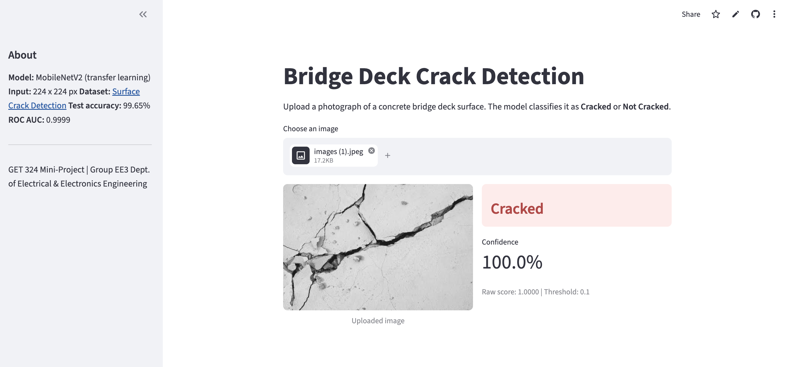
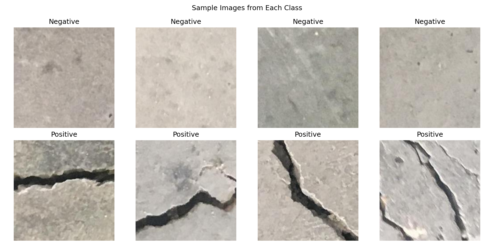
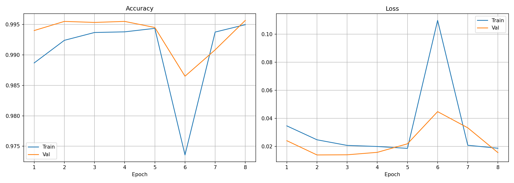
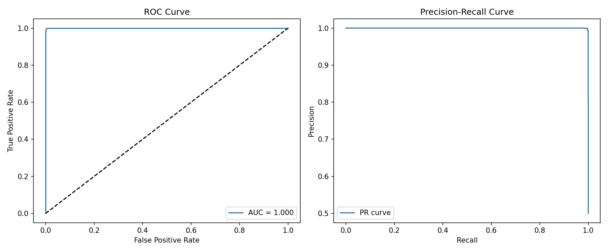

# Concrete Bridge Deck Crack Detection

Binary image classification of concrete surfaces as **Cracked** or **Not Cracked**, using MobileNetV2 transfer learning and deployed as a Streamlit web application.

**GET 324 — Laboratory Exercise 10 (Mini-Project) | Group EE3**
Department of Electrical and Electronics Engineering, 2022 Admission Set


### Live application: [concrete-bridge-deck-crack-detection.streamlit.app](https://concrete-bridge-deck-crack-detection.streamlit.app/)

---

## Contents

- [The Problem](#the-problem)
- [What the Application Does](#what-the-application-does)
- [Dataset](#dataset)
- [Model](#model)
- [Training](#training)
- [Results](#results)
- [How to Use](#how-to-use)
- [Run Locally](#run-locally)
- [Deployment](#deployment)
- [Limitations](#limitations)
- [Contributors](#contributors)
- [Citations](#citations)
- [License](#license)

---

## The Problem

Concrete bridge decks develop cracks over time due to loading, weathering, and reinforcement corrosion. Left undetected, hairline cracks admit water and chloride, corroding the reinforcing steel and eventually causing structural failures that are expensive to repair.

Traditional detection relies on manual visual inspection — an engineer walks the deck, marks what they see. This process is slow, subjective, and prone to missing fine cracks until they have already propagated.

An AI model that classifies surface photographs can screen images automatically, allowing inspectors to focus on flagged regions rather than surveying entire decks.

---

## What the Application Does

Upload a photograph of a concrete surface. The application returns:

- A label: **Cracked** or **Not Cracked**
- A confidence score for the prediction
- The decision threshold applied

The trained model runs server-side. No image is stored.

---

## Dataset

**Source:** [Surface Crack Detection](https://www.kaggle.com/datasets/arunrk7/surface-crack-detection) on Kaggle

The dataset contains **40,000 images** at 227 × 227 px, perfectly balanced:

| Class | Count |
|---|---:|
| Positive (Cracked) | 20,000 |
| Negative (Not Cracked) | 20,000 |
| **Total** | **40,000** |

Images were generated from 458 high-resolution photographs of concrete surfaces and include real-world variations such as shadows, surface roughness, staining, and debris.

**Sample images from the dataset:**



### Data Splits

We applied a stratified 70/15/15 split with a fixed random seed for reproducibility:

| Split | Positive | Negative | Total |
|---|---:|---:|---:|
| Train | 14,000 | 14,000 | 28,000 |
| Validation | 3,000 | 3,000 | 6,000 |
| Test | 3,000 | 3,000 | 6,000 |

---

## Model

We used **MobileNetV2** with ImageNet pre-trained weights as a transfer learning backbone, chosen because it trains quickly on free-tier GPU compute and produces a model small enough to deploy within Streamlit Cloud's 1 GB memory limit.

| Component | Detail |
|---|---|
| Base | MobileNetV2, ImageNet weights, 2.26M parameters |
| Input size | 224 × 224 × 3 |
| Head | GlobalAveragePooling2D → Dense(128, ReLU) → Dropout(0.5) → Dense(1, sigmoid) |
| Loss | Binary cross-entropy |
| Optimizer | Adam |
| Augmentation | Random flip, rotation, width/height shift, shear, zoom |
| Total parameters | 2,422,081 (164,097 trainable in Stage 1) |

---

## Training

Training was conducted on **Kaggle** using a Tesla P100-PCIE-16GB GPU with TensorFlow 2.20.

### Stage 1 — Head training (base frozen)

- Learning rate: 1e-3
- Epochs: 5 (early stopped from 10, patience=3)
- Best validation accuracy: **99.55%**

### Stage 2 — Fine-tuning (top layers unfrozen)

- Unfroze layers after layer 100 of MobileNetV2
- Learning rate: 1e-5
- Epochs: 3 (early stopped from 8)
- Best validation accuracy: **99.57%**

**Training curves:**



The notebook used for training is available at [`notebooks/training.ipynb`](notebooks/training.ipynb).

---

## Results

Evaluated on the held-out test set (6,000 images) that was never seen during training.

| Metric | Value |
|---|---|
| Test accuracy | **99.65%** |
| Test loss | 0.0110 |
| ROC AUC | **0.9999** |
| Decision threshold | 0.1 |

### Confusion Matrix


|  | Predicted Negative | Predicted Positive |
|---|---:|---:|
| **Actual Negative** | 2,986 | 14 |
| **Actual Positive** | 6 | 2,994 |

Out of 6,000 test images, the model misclassified only **20** — 14 false positives and 6 false negatives.

### ROC and Precision-Recall Curves



**Threshold selection.** The threshold of 0.1 was selected by maximising F1 score on the validation set. For an inspection screening tool, recall matters more than precision — a false alarm costs a quick review, while a missed crack costs a repair cycle.

---

## How to Use

1. Open the app: [concrete-bridge-deck-crack-detection.streamlit.app](https://concrete-bridge-deck-crack-detection.streamlit.app/)
2. Upload a JPG or PNG image of a concrete surface
3. The model classifies it and displays the result with a confidence score

---

## Run Locally

Requires Python 3.10–3.12.

```bash
git clone https://github.com/Victorasuquo/Concrete-Bridge-Deck-Crack-Detection_EE3.git
cd Concrete-Bridge-Deck-Crack-Detection_EE3
python3 -m venv .venv && source .venv/bin/activate
pip install -r requirements.txt
streamlit run app.py
```

The app opens at `http://localhost:8501`. The trained model ships in `model/`, so no training is needed to run it.

> **Note:** `requirements.txt` uses `tensorflow-cpu` for deployment. On macOS, replace it with `tensorflow` for local development.

---

## Deployment

Deployed on [Streamlit Community Cloud](https://share.streamlit.io), which builds directly from the `main` branch.

- `runtime.txt` pins Python 3.12 (TensorFlow does not support 3.14 yet)
- `requirements.txt` uses `tensorflow-cpu` to fit within the ~1 GB memory limit
- The model is loaded once with `@st.cache_resource` to avoid reloading on each interaction

---

## Limitations

- **Training compute.** We trained on Kaggle's free-tier GPU (Tesla P100). Training time and hyperparameter search were constrained by session limits. With more compute, we could explore larger backbones and longer training schedules.
- **Whole-image classification, not localisation.** The model classifies a patch as cracked or not. It does not localise, measure, or quantify crack width or severity.
- **Dataset scope.** The model was trained on the Surface Crack Detection dataset (general concrete surfaces). Performance on Nigerian bridge decks with different aggregate, finish, and weathering conditions is unvalidated.
- **Fixed resolution.** Input is resized to 224 × 224 px. Very fine hairline cracks in low-resolution photographs may be lost during downscaling.
- **Screening tool, not certification.** Output is a triage signal for a qualified inspector, not a structural assessment.

### Possible Improvements

- Segmentation (U-Net or similar) to localise and measure cracks
- Grad-CAM overlays in the app so inspectors can see what the model focuses on
- Collecting and labelling a local Nigerian bridge deck image set for domain-specific validation
- Test-time augmentation to stabilise borderline predictions
- Focal loss as an alternative to class weighting for harder examples

---

## Contributors

See [CONTRIBUTORS.md](CONTRIBUTORS.md) for the full team list.

---

## Citations

Özgenel, Ç. F. (2019). *Concrete Crack Images for Classification* (v2). Mendeley Data. https://doi.org/10.17632/5y9wdsg2zt.2

Sandler, M., Howard, A., Zhu, M., Zhmoginov, A., & Chen, L.-C. (2018). MobileNetV2: Inverted residuals and linear bottlenecks. *Proceedings of the IEEE/CVF Conference on Computer Vision and Pattern Recognition*, 4510–4520. https://arxiv.org/abs/1801.04381

**Dataset:** https://www.kaggle.com/datasets/arunrk7/surface-crack-detection

---

## License

MIT. See [LICENSE](LICENSE).

The dataset is the property of its respective authors and is subject to its own terms.
